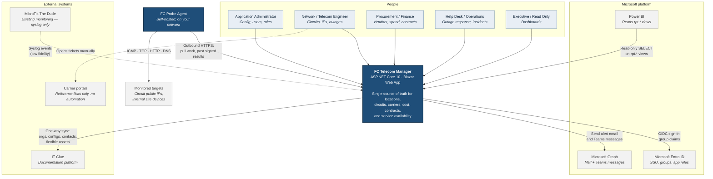
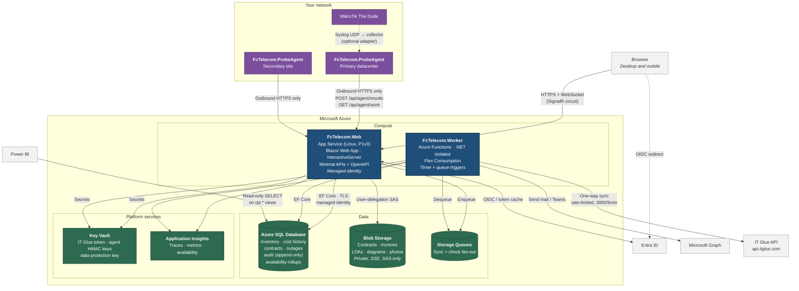
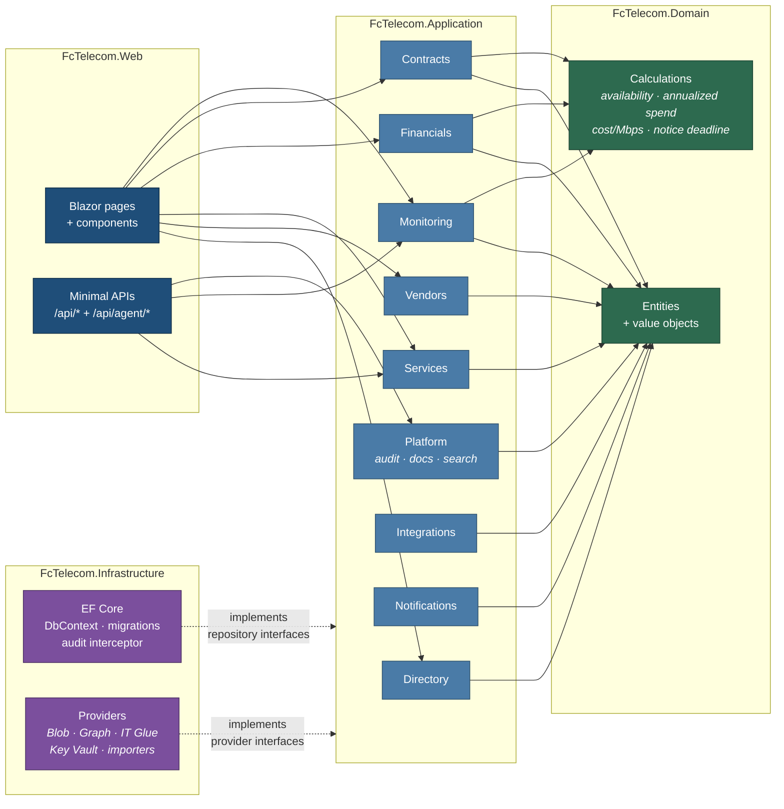
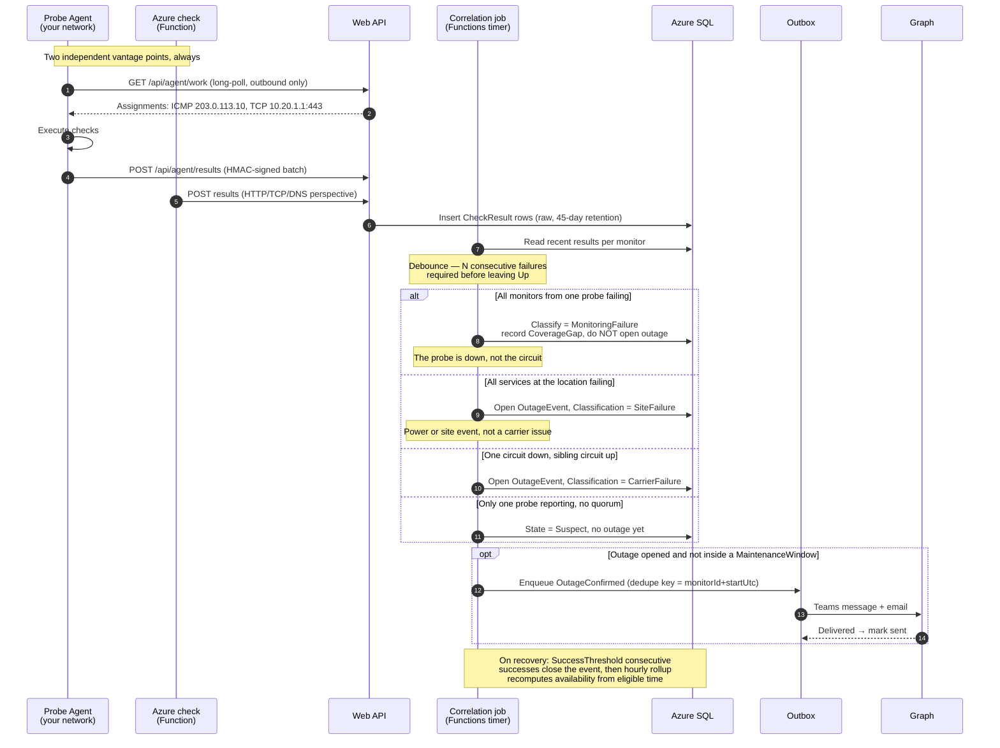
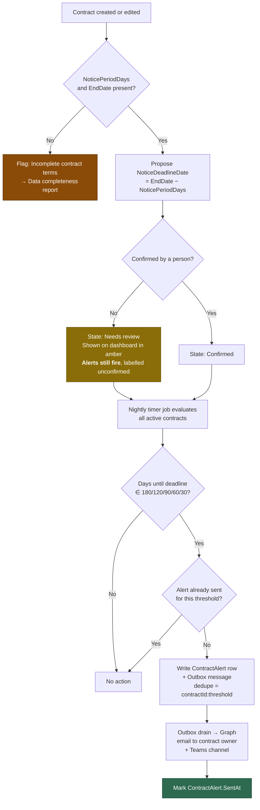
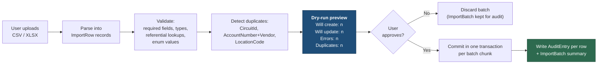

# 02 — System Diagrams

## 2.1 System context (C4 level 1)

Who and what touches FC Telecom Manager.

---

## 2.2 Container diagram (C4 level 2)

The deployable pieces and how they communicate.

---

## 2.3 Component view — the modular monolith

**Dependency rule:** arrows point inward only. `Infrastructure` implements interfaces that `Application` declares — it is never referenced by `Application`. This is enforced by an architecture test (`ArchitectureTests.cs`) that fails the build if a forbidden reference appears.

---

## 2.4 Outage detection sequence

How a raw failed check becomes a confirmed outage and an alert — including the three ways we refuse to jump to conclusions.

---

## 2.5 Contract renewal alert flow

---

## 2.6 Import dry-run flow

