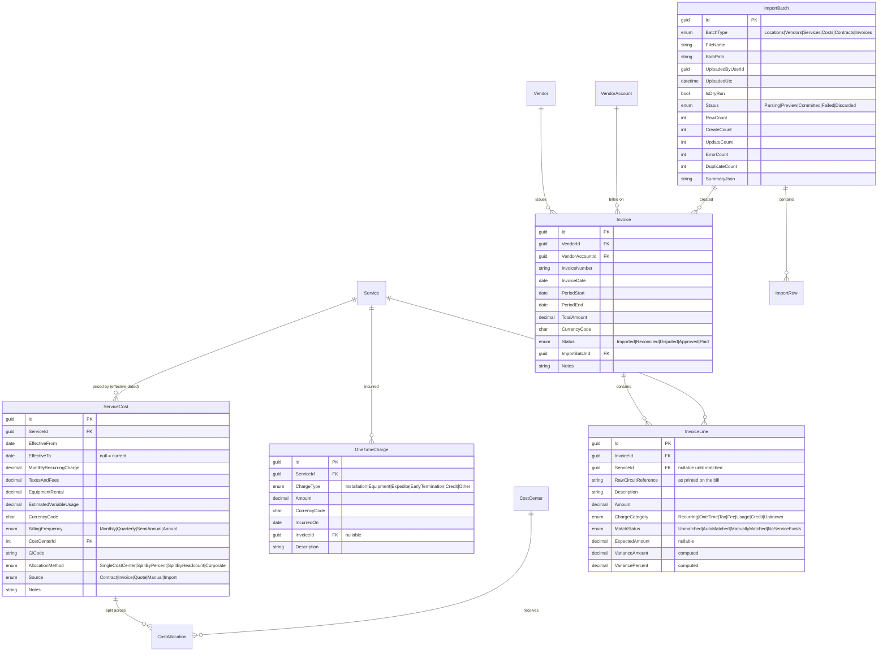
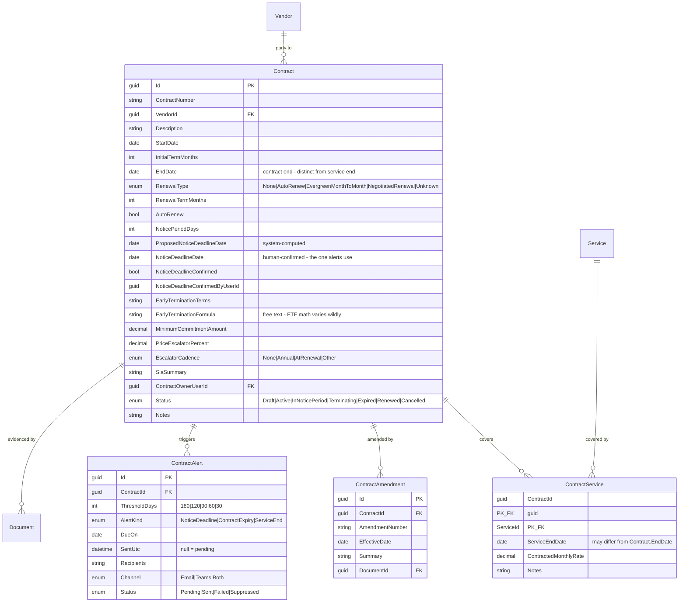
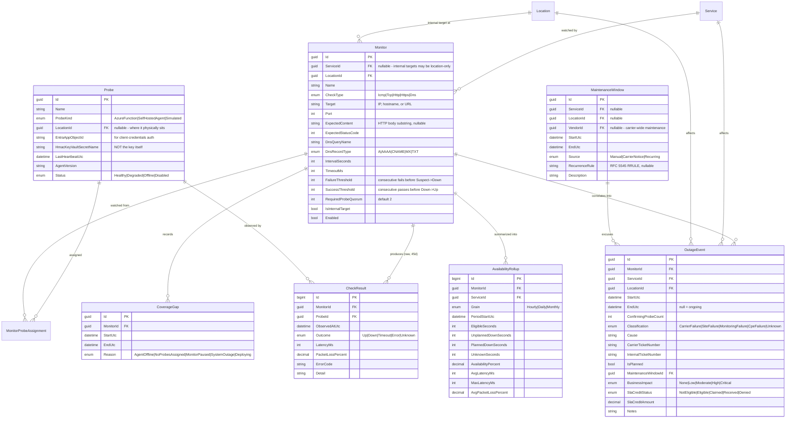

# 03 — Domain Model and ERD

Conventions applied to every table unless noted:

- **PK** `Id` — `int` identity for reference data, `Guid` (sequential, `NEWSEQUENTIALID()`-style generated client-side) for entities that may be imported or synced externally.
- **Audit fields** — `CreatedUtc`, `CreatedByUserId`, `ModifiedUtc`, `ModifiedByUserId`, `RowVersion` (`rowversion`, for optimistic concurrency).
- **Soft delete** — `IsArchived`, `ArchivedUtc`, `ArchivedByUserId`, with a global query filter. Immutable history tables (cost, audit, check results, outages) are **exempt**: they are never archived and never updated.
- **Money** — `decimal(19,4)` plus a `CurrencyCode char(3)` on the same row.
- **Bandwidth** — `int` kilobits per second. Named `*Kbps` without exception.
- **Duration** — `int` seconds, named `*Seconds`. Contract periods are `int` months, named `*Months`.
- **Time** — `datetime2(3)` UTC, named `*Utc`. Calendar-only values are `date`, named `*Date`.
- **Free-text notes** — `nvarchar(max)`, present on every top-level entity. Real telecom data never fits the schema perfectly and the alternative to a notes field is a spreadsheet on someone's desktop.

---

## 3.1 Core inventory

```mermaid
erDiagram
    Region ||--o{ Location : "groups"
    BusinessUnit ||--o{ Location : "owns"
    CostCenter ||--o{ Location : "charges"
    Location ||--o{ Service : "hosts"
    Location ||--o{ LocationContact : "has"
    Contact ||--o{ LocationContact : "fills"

    Vendor ||--o{ VendorAccount : "bills through"
    Vendor ||--o{ Contact : "employs"
    Vendor ||--o{ VendorTicketProcedure : "documents"
    Vendor ||--o{ VendorServiceOffering : "offers"
    VendorAccount ||--o{ Service : "bills"

    Vendor ||--o{ Service : "carrier"
    Service ||--o{ ServiceIdentifier : "aliased by"
    Service ||--|| ServiceBandwidth : "rated at"
    Service ||--o{ ServiceIpAssignment : "assigned (SENSITIVE)"
    Service ||--o{ ServicePhoneNumber : "carries"
    Service ||--o| VoiceServiceDetail : "voice specifics"
    Service ||--o{ ServiceDependency : "depends on"
    Service ||--o{ Document : "documented by"
    Location ||--o{ Document : "documented by"

    Location {
        guid Id PK
        string LocationCode UK "natural key, matches your ERP/AD"
        string Name
        enum Status "Active|Planned|Closing|Closed"
        enum LocationType "Office|Retail|Warehouse|DataCenter|Clinic|Remote|Other"
        string PhysicalAddress1
        string PhysicalCity
        string PhysicalState
        string PhysicalPostalCode
        string PhysicalCountry
        string MailingAddress1 "nullable, defaults to physical"
        string TimeZoneId "IANA e.g. America/Chicago"
        int RegionId FK
        int CostCenterId FK
        int BusinessUnitId FK
        string MainPhone
        guid ItOwnerContactId FK
        string OperatingHours
        decimal Latitude "decimal(9,6) nullable"
        decimal Longitude "decimal(9,6) nullable"
        enum Criticality "Critical|High|Standard|Low"
        int AcceptableOutageMinutes
        string Notes
    }

    Vendor {
        guid Id PK
        string LegalName
        string DisplayName UK
        enum VendorKind "Carrier|Reseller|LastMileProvider|Equipment|Other"
        string PortalUrl
        string SupportHours
        string MainSupportPhone
        string CredentialReference "pointer only - NEVER a password"
        guid ItGluePasswordRecordId "optional pointer"
        string Notes
    }

    Service {
        guid Id PK
        enum ServiceType "Internet|MplsVpn|PointToPoint|SdWanUnderlay|CellularBackup|FixedWireless|SipTrunk|Pri|Pots|HostedVoice|AlarmLine|ElevatorLine|FaxLine|Other"
        guid LocationId FK
        guid CarrierVendorId FK "who you buy from"
        guid ResellerVendorId FK "nullable - the agent/VAR"
        guid LastMileVendorId FK "nullable - who owns the copper/fiber"
        guid UnderlyingNetworkOwnerVendorId FK "nullable - whose backbone"
        guid VendorAccountId FK
        string CircuitId "carrier primary identifier"
        string CarrierServiceId "nullable secondary"
        enum Status "Ordered|Installing|Active|Suspended|PendingDisconnect|Disconnected"
        enum ServiceRole "Primary|Secondary|Tertiary|Standalone"
        date OrderDate
        date InstallDate
        date ActivationDate
        date DisconnectRequestedDate
        date DisconnectEffectiveDate
        string DemarcLocation "building/room/rack/panel"
        enum HandoffType "RJ45|SMF_LC|MMF_LC|Coax|T1_RJ48|SFP|Wireless|Other"
        enum Media "Fiber|Coax|Copper|FixedWireless|Cellular|Satellite|Other"
        string CpeMake
        string CpeModel
        string CpeSerial
        bool CpeManagedByCarrier
        string WanInterface "e.g. ether1 / Gi0/0/1"
        enum SupportPriority "P1|P2|P3"
        string TechnicalNotes
    }

    ServiceIdentifier {
        guid Id PK
        guid ServiceId FK
        string IdentifierType "free text - ECCKT, BAN, PON, WTN, Order #"
        string Value
        string Notes
    }

    ServiceBandwidth {
        guid ServiceId PK_FK
        int DownloadKbps
        int UploadKbps
        int CommittedInformationRateKbps
        int DataCapGb "nullable = uncapped"
        int SlaLatencyMs
        decimal SlaPacketLossPercent
        decimal SlaJitterMs
        decimal SlaAvailabilityPercent
        int AssignedBandwidthKbps "what you actually provision to it"
    }

    ServiceIpAssignment {
        guid Id PK
        guid ServiceId FK
        enum AddressFamily "IPv4|IPv6"
        string CidrEncrypted "APP-LEVEL ENCRYPTED"
        string GatewayEncrypted "APP-LEVEL ENCRYPTED"
        string UsableFirstEncrypted
        string UsableLastEncrypted
        bool IsRoutedBlock
        string DnsPrimaryEncrypted
        string DnsSecondaryEncrypted
        binary CidrSearchHash "deterministic HMAC for exact-match search"
        string AssignmentNotes
    }

    ServiceDependency {
        guid Id PK
        guid ServiceId FK
        guid DependsOnServiceId FK
        enum DependencyType "SharedLastMile|SharedConduit|SharedTower|SharedUpstream|SharedCpe|SharedPower|SharedBuildingEntrance"
        enum Confidence "Confirmed|Suspected|RuledOut"
        string Evidence "how you know - LOA, carrier statement, fiber map"
        string Notes
    }
```

### Notes on the choices that matter

**`ServiceIdentifier` exists because carriers do not agree on names.** Lumen says ECCKT, Spectrum says Circuit ID, AT&T uses BAN plus a separate service ID, and a reseller invents a third. Rather than adding a column per carrier forever, `Service.CircuitId` holds the one you actually search on and `ServiceIdentifier` holds the arbitrary rest as typed key/value pairs. Global search covers both.

**Four separate vendor foreign keys on `Service` is not over-modelling — it is the core of the diversity problem.** You buy internet from a reseller, who resells a carrier, who leases last-mile fiber from the incumbent, whose backbone belongs to someone else. Two "diverse" circuits at a location routinely share the last-mile provider or the building entrance. If you collapse these into one `VendorId`, you *cannot* answer "is this backup real?" — which is one of the five questions the location page is required to answer.

**`ServiceDependency` carries `Confidence` and `Evidence`.** "Suspected shared conduit" and "confirmed shared conduit, per the LOA" are different operational facts. Reporting treats anything not `RuledOut` as a diversity risk, so the safe default is pessimistic.

**`ServiceIpAssignment` is the only application-encrypted table**, with a deterministic `CidrSearchHash` so outage-time exact-match search still works. See `01-architecture.md` §4 for the reasoning.

**A location has *many* services.** There is no `Location.PrimaryCircuitId`. Primacy is a property of the service (`ServiceRole`), which means a location can have two primaries (dual-active SD-WAN) or four services of different types without the schema fighting you.

---

## 3.2 Financials



### Notes

**`ServiceCost` is append-only and effective-dated.** A price increase inserts a row and closes the prior one. There is a database check constraint preventing overlapping `[EffectiveFrom, EffectiveTo)` ranges per service, and a filtered unique index enforcing at most one open (`EffectiveTo IS NULL`) row per service. This is what makes "what did we pay in March 2024" answerable a year from now, and it is why the brief's instruction not to overwrite cost is enforced by the schema rather than by discipline.

**Annualized spend** is computed as `(MRC + TaxesAndFees + EquipmentRental) × 12` normalized from `BillingFrequency`, never stored. Storing it invites drift.

**`InvoiceLine.RawCircuitReference` preserves what the bill actually said** before matching. When a carrier renames a circuit mid-contract — which happens after every acquisition — this column is the only thing that lets you reconstruct why the match broke.

**`MatchStatus = NoServiceExists` is the "we are being billed for something we do not have" detector.** It feeds the *Disconnected services still being billed* report directly.

---

## 3.3 Contracts



### Notes

**Three distinct dates, deliberately.** `Contract.EndDate` (when the paper ends), `ContractService.ServiceEndDate` (when *this circuit's* term ends — often staggered because circuits were added mid-term), and `Contract.NoticeDeadlineDate` (the date that actually matters, because missing it triggers an auto-renewal nobody wanted). Conflating any two of these is the single most expensive modelling error in this domain, and it is exactly what the brief warns against.

**`ProposedNoticeDeadlineDate` vs `NoticeDeadlineDate`.** The system computes the proposal; a person confirms it. Unconfirmed deadlines still generate alerts — labelled as unconfirmed — because suppressing an alert on a technicality is worse than sending an uncertain one. See open question Q4.

**`Contract ⟷ Service` is many-to-many.** One master agreement covers 40 circuits; one circuit can be covered by a master agreement and a separate SLA addendum.

---

## 3.4 Monitoring



### The availability calculation

```
AvailabilityPercent = (EligibleSeconds − UnplannedDownSeconds) / EligibleSeconds × 100

where EligibleSeconds = TotalPeriodSeconds − PlannedDownSeconds − UnknownSeconds
```

`UnknownSeconds` accumulates from `CoverageGap` rows. Excluding unknown time from the denominator rather than counting it as up is the difference between an availability number an executive can act on and one that quietly inflates itself every time the monitoring stack hiccups. When `EligibleSeconds` falls below a configurable fraction of the period (default 90%), the rollup is flagged `LowConfidence` and the UI shows the coverage percentage alongside the availability figure.

### Retention

| Table | Retention | Mechanism |
|---|---|---|
| `CheckResult` | 45 days (configurable) | Nightly Functions job, batched delete by `ObservedAtUtc`, clustered index ordered to make it a range scan |
| `AvailabilityRollup` (Hourly) | 13 months | Same job |
| `AvailabilityRollup` (Daily/Monthly) | 7 years | Retained |
| `OutageEvent` | Indefinite | Never deleted — this is the SLA and incident record |
| `CoverageGap` | Matches hourly rollups | — |

---

## 3.5 Platform, security, and integrations

```mermaid
erDiagram
    AppUser ||--o{ RoleAssignment : "holds"
    AppRole ||--o{ RoleAssignment : "granted via"
    AppRole ||--o{ RolePermission : "grants"
    EntraGroupRoleMap }o--|| AppRole : "maps to"
    AppUser ||--o{ AuditEntry : "performed"
    AppUser ||--o{ SecurityEvent : "triggered"
    AppUser ||--o{ SavedView : "saved"

    IntegrationConnection ||--o{ ExternalRecordLink : "tracks"
    IntegrationConnection ||--o{ FieldMapping : "configured by"
    IntegrationConnection ||--o{ SyncRun : "executes"
    SyncRun ||--o{ SyncLogEntry : "logs"

    NotificationRule ||--o{ NotificationOutbox : "produces"

    AppUser {
        guid Id PK
        string EntraObjectId UK "the stable identity key - never the UPN"
        string UserPrincipalName
        string DisplayName
        string Email
        datetime LastLoginUtc
        bool IsActive
    }

    AppRole {
        int Id PK
        string Name UK "AppAdministrator|NetworkEngineer|Procurement|HelpDesk|ReadOnly"
        string Description
        bool IsSystemRole "cannot be deleted"
    }

    RolePermission {
        int RoleId PK_FK
        string Permission PK "e.g. Services.Write, ServiceIpData.Read"
    }

    EntraGroupRoleMap {
        int Id PK
        string EntraGroupObjectId UK "object ID, NOT display name"
        string EntraGroupDisplayName "cached for UI only"
        int RoleId FK
        bool Enabled
    }

    AuditEntry {
        bigint Id PK
        datetime OccurredUtc
        guid ActorUserId
        string ActorUpn "denormalized - survives user deletion"
        string EntityType
        string EntityId
        enum Action "Create|Update|Archive|Restore|Import|Export"
        string ChangesJson "old/new per property; sensitive = [redacted]"
        guid CorrelationId
        string IpAddress
    }

    SecurityEvent {
        bigint Id PK
        datetime OccurredUtc
        enum EventType "SignIn|SignInFailed|AuthorizationDenied|SensitiveFieldRevealed|ExportGenerated|DocumentDownloaded|SecretRotated|AgentAuthFailed"
        guid ActorUserId
        string ActorUpn
        string Detail
        guid CorrelationId
        string IpAddress
    }

    Document {
        guid Id PK
        string OwnerEntityType "Location|Service|Contract|Vendor|Invoice"
        string OwnerEntityId
        enum DocumentType "Contract|Amendment|Invoice|Loa|NetworkDiagram|InstallDoc|Photo|Correspondence|Other"
        string FileName
        string BlobPath
        string ContentType
        bigint SizeBytes
        string Sha256
        enum Sensitivity "Normal|Restricted"
        guid UploadedByUserId
        datetime UploadedUtc
    }

    IntegrationConnection {
        guid Id PK
        string SystemKey UK "ITGlue|TheDudeSyslog|..."
        string DisplayName
        string BaseUrl
        string ApiKeySecretName "Key Vault secret NAME - never the value"
        bool Enabled
        enum SyncDirection "OutboundOnly|InboundOnly|Bidirectional"
        string ScheduleCron
        datetime LastSuccessfulSyncUtc
        string ErrorState
        int ConsecutiveFailures
    }

    ExternalRecordLink {
        guid Id PK
        guid ConnectionId FK
        string LocalEntityType
        string LocalEntityId
        string ExternalId "IT Glue record ID"
        string ExternalType "flexible_assets|configurations|contacts|organizations"
        datetime LastSyncedUtc
        string LocalVersionHash
        string ExternalVersionHash
        enum SyncState "Pending|Synced|Conflict|Failed|Orphaned"
        int RetryCount
        string LastError
    }

    FieldMapping {
        guid Id PK
        guid ConnectionId FK
        string LocalEntityType
        string LocalField
        string ExternalField
        string TransformExpression
        bool IsSensitive "if true, blocked from sync by default"
        bool IncludeInSync
    }

    NotificationOutbox {
        bigint Id PK
        guid RuleId FK
        string EventType
        string PayloadJson
        string DedupeKey UK
        enum Status "Pending|Sending|Sent|Failed|Suppressed"
        int Attempts
        datetime ScheduledUtc
        datetime SentUtc
        string LastError
    }
```

### Notes

**`ExternalRecordLink` has a unique index on `(ConnectionId, LocalEntityType, LocalEntityId)`** and a second on `(ConnectionId, ExternalType, ExternalId)`. Sync is therefore deterministic and idempotent: re-running it updates rather than duplicating. This is the concrete implementation of the brief's "avoid using names as integration keys."

**`FieldMapping.IsSensitive` defaults every static-IP and credential-adjacent field to excluded.** Enabling one requires an explicit action by an Application Administrator and writes a `SecurityEvent`.

**`AuditEntry.ActorUpn` is denormalized on purpose.** When a user leaves and the `AppUser` row is deactivated, the audit trail must still say who did it, in a form a human reads. Referential purity loses to forensic usefulness here.

**`NotificationOutbox.DedupeKey` is unique.** A redeploy mid-drain, a retry storm, or a duplicated timer fire cannot double-send. Suppression is a first-class state so a muted alert is visible rather than invisible.

---

## 3.6 Permission catalogue

| Permission | Admin | Engineer | Procurement | Help Desk | Read Only |
|---|:-:|:-:|:-:|:-:|:-:|
| `Locations.Read` | ✔ | ✔ | ✔ | ✔ | ✔ |
| `Locations.Write` | ✔ | ✔ | — | — | — |
| `Vendors.Read` | ✔ | ✔ | ✔ | ✔ | ✔ |
| `Vendors.Write` | ✔ | — | ✔ | — | — |
| `Services.Read` | ✔ | ✔ | ✔ | ✔ | ✔ |
| `Services.Write` | ✔ | ✔ | — | — | — |
| `ServiceIpData.Read` | ✔ | ✔ | — | — | — |
| `ServiceIpData.Write` | ✔ | ✔ | — | — | — |
| `Costs.Read` | ✔ | — | ✔ | — | ✔ |
| `Costs.Write` | ✔ | — | ✔ | — | — |
| `Contracts.Read` | ✔ | ✔ | ✔ | — | ✔ |
| `Contracts.Write` | ✔ | — | ✔ | — | — |
| `Incidents.Read` | ✔ | ✔ | — | ✔ | ✔ |
| `Incidents.Write` | ✔ | ✔ | — | ✔ | — |
| `Monitoring.Manage` | ✔ | ✔ | — | — | — |
| `Documents.Read` | ✔ | ✔ | ✔ | ✔ | — |
| `Documents.Write` | ✔ | ✔ | ✔ | — | — |
| `Import.Run` | ✔ | ✔ | ✔ | — | — |
| `Export.Run` | ✔ | ✔ | ✔ | ✔ | ✔ |
| `Integrations.Manage` | ✔ | — | — | — | — |
| `Audit.Read` | ✔ | — | — | — | — |
| `Admin.Manage` | ✔ | — | — | — | — |

`ServiceIpData.Read` is separately grantable to any individual user regardless of role — that is the "unless separately authorized" clause in the brief, made concrete. Granting it writes a `SecurityEvent`; using it writes another.

Note that Executive/Read Only can see `Costs.Read` but not `ServiceIpData.Read` — an executive needs the spend number, not the public IP inventory. Help Desk gets the reverse of Procurement: incidents and escalation details, no financial data.

---

## 3.7 Key indexes

| Table | Index | Why |
|---|---|---|
| `Service` | `IX_Service_CircuitId` (unique filtered, non-archived) | Outage-time lookup; duplicate detection on import |
| `Service` | `IX_Service_LocationId_Status` | Location detail page |
| `Service` | `IX_Service_CarrierVendorId_ServiceType` | Spend-by-carrier reporting |
| `ServiceIdentifier` | `IX_ServiceIdentifier_Value` | Global search across carrier aliases |
| `ServiceIpAssignment` | `IX_ServiceIpAssignment_CidrSearchHash` | Exact-match IP search without decryption |
| `ServiceCost` | `IX_ServiceCost_ServiceId_EffectiveFrom` + filtered unique on open row | Effective-dated lookup; prevents two open rows |
| `Contract` | `IX_Contract_NoticeDeadlineDate` (filtered: Status = Active) | Nightly renewal scan |
| `CheckResult` | Clustered `(MonitorId, ObservedAtUtc)` | Correlation reads and range-delete retention |
| `OutageEvent` | `IX_OutageEvent_EndUtc` (filtered: `EndUtc IS NULL`) | "Current outages" dashboard tile — a tiny index over ongoing events only |
| `AuditEntry` | `IX_AuditEntry_EntityType_EntityId_OccurredUtc` | Per-record history view |
| `ExternalRecordLink` | Unique `(ConnectionId, LocalEntityType, LocalEntityId)` | Idempotent sync |
| `NotificationOutbox` | Unique `DedupeKey`; `IX_Outbox_Status_ScheduledUtc` | Drain query and double-send prevention |
