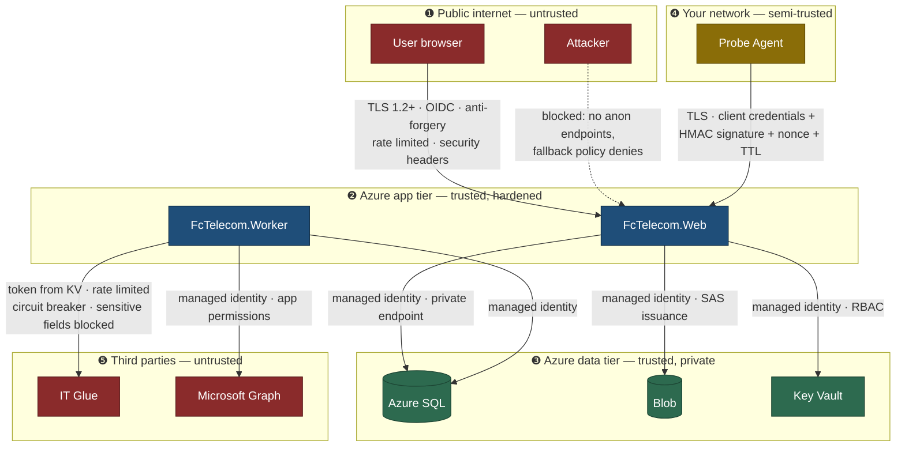

# 07 — Threat Model and Security Checklist

## 1. What we are actually protecting

Ranked by what an attacker would want and what would hurt most if lost.

| Asset | Why it matters | Classification |
|---|---|---|
| **Static IP / CIDR inventory** | A complete map of the organization's public attack surface, cross-referenced to physical addresses and criticality ratings. This is a reconnaissance document. | **Restricted** |
| **Carrier account numbers + support procedures** | Sufficient for social engineering a carrier into a service change, a redirect, or a disconnection. Carriers authenticate callers weakly. | **Restricted** |
| **Contract terms and pricing** | Commercially sensitive; useful to a competitor and to the carrier's own sales team. | Confidential |
| **Contract and invoice documents** | Same, plus signatures and sometimes banking details. | Confidential |
| **Location list with criticality and outage thresholds** | Tells an attacker which site to hit for maximum impact. | Confidential |
| **Integration tokens (IT Glue, Graph)** | Lateral movement into the documentation platform, which holds far more. | **Secret** |
| **Probe agent credentials** | Ability to inject false monitoring data — fabricate outages or, worse, suppress real ones. | **Secret** |
| **Audit log** | Its integrity is the basis for every after-the-fact investigation. | Integrity-critical |

The two things this system holds that a generic CRUD app does not are the **public IP map** and the **carrier account numbers**. Most of the design decisions below exist because of those two.

---

## 2. STRIDE analysis

### Spoofing

| Threat | Mitigation |
|---|---|
| Attacker impersonates a user | Entra ID OIDC only. No local password store exists to attack. MFA and Conditional Access are enforced at the tenant, not reimplemented here. |
| Attacker impersonates a probe agent to inject false results | Agent authenticates with client credentials from a dedicated Entra app registration **and** signs each result batch with a per-agent HMAC key held in Key Vault. Both must validate. Payloads carry a nonce and a timestamp; results older than a 5-minute window or with a replayed nonce are rejected. |
| Attacker forges an internal service call | Managed identity for all Azure resource access. No shared keys, no connection-string secrets. |
| Local dev auth bypass reaches production | The bypass is inside `#if DEBUG` **and** gated on a configuration flag **and** asserted absent by a test that fails if it can be reached in a Release build. Three locks, because this is the single most common way a well-designed app ends up unauthenticated. |

### Tampering

| Threat | Mitigation |
|---|---|
| Someone edits history to hide a mistake | `AuditEntry`, `ServiceCost`, `CheckResult`, `OutageEvent` are append-only. The application's SQL principal is granted `INSERT` and `SELECT` on `AuditEntry` and **not** `UPDATE` or `DELETE`. This is a database grant, not application logic — application logic can be bypassed by a bug. |
| SQL injection | EF Core parameterization throughout. Raw SQL appears only in the `rpt.*` view definitions, which take no user input. Analyzer rules flag string-concatenated SQL. |
| Mass assignment / over-posting | Commands are explicit DTOs with explicit mapping. Entities are never bound directly to a form. |
| Import file poisons the dataset | Mandatory dry-run preview, schema validation, referential validation, duplicate detection, and per-row error reporting before any commit. Commit is transactional per chunk. |
| CSV formula injection in exports | Exported cell values beginning `=`, `+`, `-`, or `@` are prefixed with a single quote. A contract note field containing `=HYPERLINK(...)` should not execute when Finance opens the export. |

### Repudiation

| Threat | Mitigation |
|---|---|
| "I never changed that circuit's cost" | Audit entry written in the same transaction as the change, with actor UPN denormalized so it survives user deactivation. Correlation ID ties the change to the request and to any downstream worker activity. |
| "I never looked at those IP blocks" | Revealing a sensitive field writes a `SecurityEvent` with actor, entity, timestamp, and IP address. Same for document downloads and exports. |
| Agent denies submitting a result | Signed payloads are retained with the signature for the raw-result retention period. |

### Information disclosure

This is the dominant risk category for this system.

| Threat | Mitigation |
|---|---|
| Procurement user sees static IP blocks | Field-level projection in the **query handler**. The value is never placed in a DTO the user's session can access, so it never enters the Blazor render tree or a JSON response. UI masking alone is explicitly rejected as a control. |
| A database backup, a read-replica, or a reporting connection leaks the IP inventory | `ServiceIpAssignment` values are encrypted at the application layer with a Key Vault–backed key. A database copy without the Key Vault key yields ciphertext. The reporting SQL principal has `SELECT` on `rpt.*` only and no grant on base tables. |
| Sensitive values leak through logs | A Serilog destructuring policy and a redaction enricher strip: tokens, `Authorization` headers, `ServiceIpAssignment` properties, document byte content, and invoice line amounts from log properties. Enforced by a unit test that asserts a log event containing a known sensitive property is emitted redacted. |
| Sensitive values leak through error pages | `UseExceptionHandler` with a generic error page in all non-Development environments. Developer exception page is Development-only, asserted by test. |
| Document URLs get shared and remain valid | Blob containers are private. Downloads use per-request user-delegation SAS with a short TTL (default 5 minutes) and are logged. There is no permanent URL to leak. |
| Search results reveal the existence of records a user may not see | Search is permission-scoped at the query, not filtered at render. A user without `Costs.Read` searching an invoice number gets "no results", not "access denied" — the second answer confirms the record exists. |
| IT Glue sync exports IP data | `FieldMapping.IsSensitive` defaults every IP and credential-adjacent field to excluded. Enabling one requires `Integrations.Manage` and writes a `SecurityEvent`. |
| Verbose API responses expose internals | OpenAPI is served in Development and to authenticated `Admin.Manage` holders only. Stack traces never cross the wire. |

### Denial of service

| Threat | Mitigation |
|---|---|
| Request flood | ASP.NET Core rate limiting: a global partitioned limiter by user, tighter fixed-window limits on `/api/agent/*`, export, and import endpoints. |
| Expensive report query | Reports read pre-aggregated `rpt.*` views and rollup tables, never raw `CheckResult`. Query timeout enforced. Export row caps with a documented ceiling. |
| Import of a huge file | Upload size limit, row-count ceiling, chunked processing, and a per-user concurrent-import limit of one. |
| A slow or hostile IT Glue response hangs the app | The sync runs in Functions, never in the web tier. Typed `HttpClient` with timeout → retry → circuit breaker. |
| Agent floods the results endpoint | Per-agent rate limit and batch size cap; oversized batches rejected with 413. |

### Elevation of privilege

| Threat | Mitigation |
|---|---|
| Missing `[Authorize]` on a new page or endpoint | `FallbackPolicy` requires an authenticated user, so an unmarked endpoint fails closed rather than open. A completeness test asserts every endpoint appears in the authorization matrix. |
| Role escalation via group manipulation | Group→role mapping keys on Entra group **object ID**, never display name. Changing the map requires `Admin.Manage` and writes both an `AuditEntry` and a `SecurityEvent`. |
| Horizontal escalation (viewing another region's data) | Not applicable in Phase 1 — all authorized users see all locations. **This is a deliberate, stated limitation.** If regional data segregation is ever required, it must be designed in as a query-level filter, not bolted on, and it is called out here so nobody assumes it already exists. |
| Agent token used to call non-agent APIs | The agent's Entra app registration holds a single app role (`Probe.Submit`). Agent endpoints require that role; user endpoints reject it. Separate authorization schemes, not a shared one. |

---

## 3. Trust boundaries

The agent sits in boundary ❹ deliberately. It runs on hardware inside your network, but the application must not assume that means it is trustworthy — a compromised agent is a plausible path to injecting false monitoring data. Hence signature verification, replay protection, and a single narrow app role.

---

## 4. Security checklist

Grouped by when it is verified.

### Verified by automated test (fails the build)

- [ ] Every API endpoint and Blazor page has an explicit authorization policy, or is in an approved anonymous allow-list
- [ ] Role × permission matrix matches the specification exactly
- [ ] Every endpoint appears in the authorization test matrix (completeness assertion)
- [ ] `ServiceIpAssignment` fields are absent from DTOs when the caller lacks `ServiceIpData.Read`
- [ ] Sensitive properties are redacted in emitted log events
- [ ] Development auth bypass is unreachable in a Release build
- [ ] Layering rules hold (`Domain` references nothing; `Application` does not reference `Infrastructure`)
- [ ] Exported cells beginning `= + - @` are escaped
- [ ] Anti-forgery is enforced on state-changing endpoints
- [ ] Security headers are present on every response

### Verified in CI

- [ ] `dotnet list package --vulnerable --include-transitive` reports nothing at High or above
- [ ] CodeQL scan clean
- [ ] Dependency review on pull requests
- [ ] Bicep what-if reviewed before production apply
- [ ] No secret patterns in the repository (secret scanning + push protection)

### Verified by configuration review

- [ ] HTTPS enforced; HSTS with `includeSubDomains` and a sensible max-age
- [ ] CSP without `unsafe-inline` (Blazor's required inline scripts use nonces), plus `X-Content-Type-Options`, `Referrer-Policy: strict-origin-when-cross-origin`, `X-Frame-Options: DENY`, `Permissions-Policy` minimal
- [ ] TLS 1.2 minimum on App Service, SQL, and Storage
- [ ] Managed identity used for SQL, Blob, and Key Vault — zero connection-string secrets in App Service configuration
- [ ] Key Vault: RBAC authorization, soft delete and purge protection on, network restricted
- [ ] SQL: Entra-only authentication, TDE on, auditing to Log Analytics, firewall closed to public where private endpoints are used
- [ ] Storage: public blob access disabled at the account level, `AllowSharedKeyAccess` disabled, minimum TLS 1.2, SSE with Microsoft-managed keys
- [ ] Application's SQL principal has no `UPDATE`/`DELETE` grant on `AuditEntry` or `SecurityEvent`
- [ ] Reporting SQL principal has `SELECT` on `rpt.*` only
- [ ] Rate limiting configured on user, agent, export, and import surfaces
- [ ] Diagnostic settings ship SQL, Key Vault, App Service, and Storage logs to Log Analytics

### Verified by operational practice

- [ ] Entra Conditional Access requires MFA for all application roles
- [ ] Privileged Identity Management for the Application Administrator group, if licensed
- [ ] Access reviews quarterly on all five role groups and on individual `ServiceIpData.Read` grants
- [ ] IT Glue API token rotated on a documented schedule; rotation runbook exists and has been executed once
- [ ] Agent HMAC keys rotated on agent re-registration; runbook exists
- [ ] Restore tested from point-in-time backup at least once per quarter, against a scratch database
- [ ] Alerting on: failed sign-ins, authorization denials, agent auth failures, outbox failures, sync failures

---

## 5. Data retention

| Data | Retention | Rationale |
|---|---|---|
| `CheckResult` (raw) | 45 days, configurable | Enough for incident forensics; beyond that the rollups carry the signal at a fraction of the storage |
| `AvailabilityRollup` — hourly | 13 months | Year-over-year comparison |
| `AvailabilityRollup` — daily / monthly | 7 years | SLA and contract dispute horizon |
| `OutageEvent` | Indefinite | The incident record; never deleted |
| `AuditEntry` | 7 years | Matches typical financial record retention |
| `SecurityEvent` | 2 years | Investigation window |
| Documents (contracts, invoices) | Contract end + 7 years | Blob lifecycle policy moves to Cool at 90 days, Archive at 1 year |
| `ServiceCost` history | Indefinite | Required to reproduce any historical report |
| `NotificationOutbox` (sent) | 90 days | Delivery troubleshooting |
| Archived (soft-deleted) records | Indefinite by default; purge requires `Admin.Manage` and writes an audit entry | Soft delete that silently hard-deletes later is worse than no soft delete |

## 6. Backup, restore, and disaster recovery

| | Target | Mechanism |
|---|---|---|
| **RPO** | ≤ 5 minutes | Azure SQL automated backups with point-in-time restore; transaction log backups every 5–10 minutes |
| **RTO** | ≤ 4 hours | Redeploy from Bicep + restore database. The application tier is stateless and rebuildable from the repository |
| Database backups | 7-day PITR, 12-month long-term weekly retention | Azure SQL native |
| Documents | GRS on the storage account; blob versioning and soft delete (30 days) | Storage native |
| Key Vault | Soft delete + purge protection | Key Vault native |
| Configuration | Everything in Bicep; nothing configured by hand in the portal | IaC |
| **Data export** | Full portfolio export to Excel, on demand, by any user with `Export.Run` | This is the exit strategy. A tool you cannot get your data out of is a trap, and it is worth stating that explicitly in a document like this. |

Restore procedure, rehearsal cadence, and the exact `az` commands live in `docs/runbooks/restore-and-dr.md`.

---

## 7. Residual risks — accepted, with eyes open

| Risk | Why we accept it | Revisit when |
|---|---|---|
| No regional/row-level data segregation | Every authorized user is trusted with the whole portfolio in a single-organization deployment. Adding tenancy filters now taxes every query. | An acquisition, a managed-service arrangement, or a contractor needing scoped access |
| Blazor Server holds server-side circuit state | Memory per concurrent user is small at this org size; ARR affinity covers scale-out to a few hundred users. | Concurrent users exceed ~500, or multi-region active-active is required |
| Application-level encryption uses a single key for `ServiceIpAssignment` | Per-record keys would complicate rotation with no meaningful threat reduction at this scale. | A regulatory requirement for per-record key separation appears |
| The Dude ingestion is low-fidelity (syslog only) | The platform offers nothing better — validated, see `09-integration-validation.md`. | The Dude gains a supported API, or the agent replaces it |
| Carrier account numbers are stored in plaintext | They are needed constantly during outages by users who are already authorized, and they appear in exports and support summaries by design. Encrypting them would break the primary workflow. | A specific incident of carrier social engineering makes the tradeoff worth revisiting |
