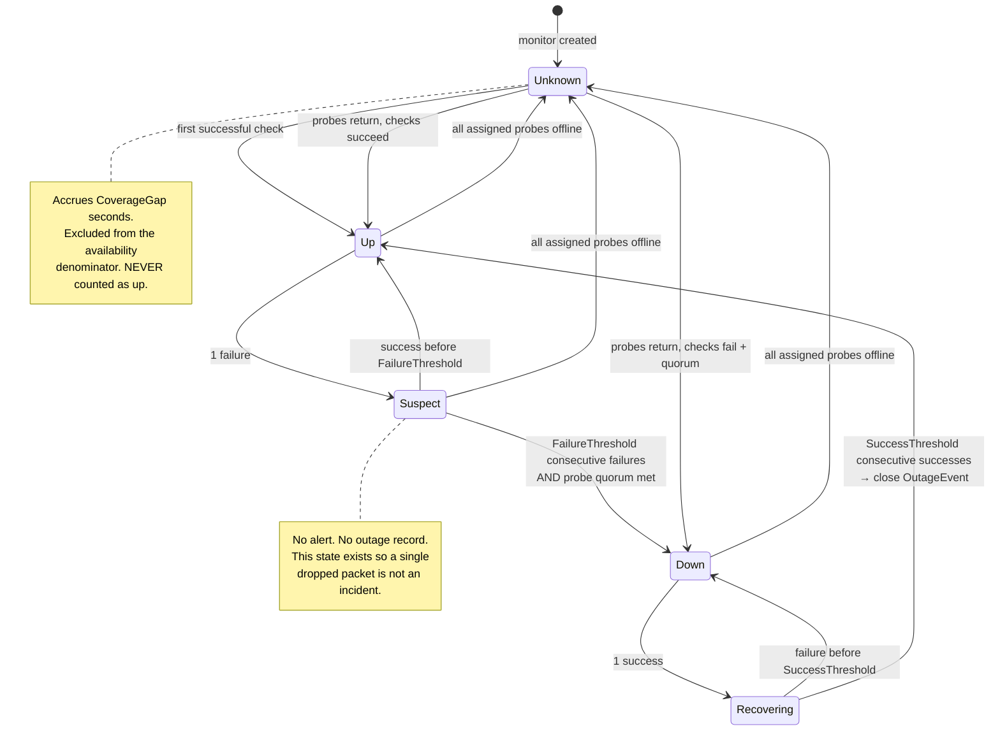

# 10 — Uptime Monitoring Design

Monitoring is a Phase 3 module. It is designed now, and the schema and interfaces ship in Phase 1, so that the inventory MVP is never blocked on monitoring infrastructure and monitoring is never bolted on afterward.

**The organizing principle:** it is better to report *"we don't know"* than to report a confident wrong answer. Every design decision below follows from that. A monitoring system that cries wolf twice gets ignored forever, and an availability number nobody trusts is worse than no number at all because it still gets put in front of executives.

---

## 1. Provider architecture

```
IMonitoringProvider          ← Application layer declares it
   ├── SimulatedProvider     ← dev/demo. Deterministic, seedable, injects failures on demand
   ├── AzureCheckProvider    ← HTTP/HTTPS, TCP, DNS from Azure Functions. No ICMP.
   ├── AgentProvider         ← ICMP, TCP, HTTP, DNS from your network. Full capability.
   └── ExternalIngestProvider ← The Dude syslog, or another platform's webhook. Advisory only.
```

`CompositeMonitoringProvider` routes each `Monitor` to the providers assigned via `MonitorProbeAssignment`. Adding a fifth provider is a DI registration, not a redesign.

### Recommendation on the production provider

**Both Azure-native and self-hosted agent, together — neither alone is sufficient.**

| | Azure Functions | Self-hosted agent |
|---|---|---|
| ICMP | ✗ Not possible — outbound ICMP is blocked on App Service and Functions | ✓ |
| Internal targets behind your firewall | ✗ | ✓ |
| Independent of your network's health | ✓ | ✗ |
| Independent of Azure's health | ✗ | ✓ |
| Ops burden | None | A small service to keep running |

Anyone claiming a cloud-only design can ping your circuits is mistaken. Anyone claiming an on-premises-only design gives you an independent outside perspective is also mistaken — if the agent is on the network being measured, it cannot distinguish "the circuit is down" from "I am cut off." You need both, and the quorum logic exists precisely to exploit the difference between them.

---

## 2. Check types

| Type | Runs from | What it proves | Blind spots |
|---|---|---|---|
| **ICMP** | Agent only | Layer 3 reachability | Frequently rate-limited or blocked by carriers; deprioritized on loaded routers, so latency readings are noisy |
| **TCP connect** | Both | A port is accepting connections | Says nothing about what is behind the port |
| **HTTP/HTTPS** | Both | Application-layer response, optional status code and body-content match | A captive portal or carrier error page can return 200 |
| **DNS** | Both | Resolver reachability and answer correctness | Cached answers can mask a resolver failure |

Each `Monitor` records `IntervalSeconds`, `TimeoutMs`, `FailureThreshold`, `SuccessThreshold`, and `RequiredProbeQuorum`. Defaults: 60s interval, 5s timeout, 3 consecutive failures to leave `Up`, 2 consecutive successes to return, quorum of 2.

---

## 3. The probe agent

### Protocol

Outbound-only. **No inbound firewall rule at any of your sites, ever.** That is a hard requirement, not a preference — an inventory tool that asks the network team to open ports at 124 locations will not be deployed.

```
Agent                                    Application
  │                                           │
  │──── POST /api/agent/register ────────────▶│  once, at first start
  │◀─── agent ID + HMAC key reference ────────│
  │                                           │
  │──── GET /api/agent/work (long-poll) ─────▶│  held up to 30s
  │◀─── assignments + config version ─────────│
  │                                           │
  │  [executes checks locally]                │
  │                                           │
  │──── POST /api/agent/results ─────────────▶│  batched, HMAC-signed
  │◀─── 202 Accepted + next-poll hint ────────│
  │                                           │
  │──── POST /api/agent/heartbeat ───────────▶│  every 60s, carries version + health
```

### Authentication and integrity

Three independent controls, because a compromised agent can fabricate outages *or suppress real ones*, and the second is the more dangerous failure:

1. **Entra ID client credentials.** A dedicated app registration with a single app role, `Probe.Submit`. Agent endpoints require that role; user endpoints reject it. Separate authorization schemes, not a shared one.
2. **HMAC signature** over a canonical serialization of each result batch, using a per-agent key stored in Key Vault. The agent holds only its own key. Compromising one agent does not let you forge another's results.
3. **Replay protection.** Each batch carries a nonce and a timestamp. Batches older than 5 minutes, or with a nonce seen inside that window, are rejected and write a `SecurityEvent`.

### Intermittent connectivity

The agent is expected to lose its connection — often, and precisely during the events it exists to measure.

- Results buffer to a local file-backed queue, capped at a configurable size with oldest-first eviction.
- On reconnect, buffered batches upload with their **original observation timestamps**, not the upload time.
- Clock skew is measured against the server's response and recorded per batch. Batches with skew beyond a threshold are accepted but flagged, and the correlation engine treats their ordering as uncertain.
- **The gap during which the agent was offline becomes a `CoverageGap`, not a stream of `Down` results.** This is the single most important behaviour in the agent, and it is what most monitoring stacks get wrong: an offline probe means unknown, never down.

---

## 4. Outage correlation

Raw checks are never incidents. A state machine per monitor produces outage events.



### Classification

When an outage opens, the correlation engine classifies it by looking at what *else* is failing at the same moment:

| Observation | Classification | Reasoning |
|---|---|---|
| Every monitor assigned to one probe is failing, monitors on other probes are fine | `MonitoringFailure` | The probe is down, not the circuits. **No outage is opened**; a `CoverageGap` is recorded instead |
| Every service at a location is failing, from multiple probes | `SiteFailure` | Power, site event, or a total site disconnection — not a single carrier's fault |
| One circuit down, a sibling circuit at the same location up | `CarrierFailure` | The site has connectivity; this carrier does not |
| Circuit's public IP unreachable but an internal target at the site is reachable from the agent | `CarrierFailure` | The site is alive; the transport is not |
| Circuit's public IP reachable but internal target unreachable | `CpeFailure` | The carrier's edge answers; something behind it is broken |
| Insufficient evidence | `Unknown` | We say so rather than guessing |

Every classification is shown in the UI **with the reasoning that produced it** (see the outage view in `05-wireframes.md`). A classification an engineer cannot argue with is a classification they will ignore.

### Why quorum matters

A single perspective cannot distinguish these three situations:

1. The circuit is down.
2. The path between the observer and the circuit is down.
3. The observer is down.

Two independent perspectives distinguish all three in most cases. This is why `RequiredProbeQuorum` defaults to 2 and why a monitor with only one assigned probe is flagged on the dashboard as **reduced confidence** — it will still open outages, but the UI says the confidence is lower and the availability rollup is marked accordingly.

---

## 5. Availability calculation

```
EligibleSeconds     = PeriodSeconds − PlannedDownSeconds − UnknownSeconds
AvailabilityPercent = (EligibleSeconds − UnplannedDownSeconds) / EligibleSeconds × 100
```

Three properties this formula has, each deliberate:

**Unknown time is removed from the denominator, not counted as up.** If monitoring was blind for 10% of a month, availability is computed over the 90% that was measured and the coverage figure is reported alongside it. Counting unknown time as available is the standard way uptime reports quietly inflate themselves.

**Planned maintenance is excluded but preserved.** A `MaintenanceWindow` removes time from the eligible denominator, but the underlying `OutageEvent` is still recorded, linked to the window, and visible. Nothing is silently deleted — you can always ask "how much total downtime, including planned?"

**Low confidence is flagged, not hidden.** When `EligibleSeconds` falls below `MinimumCoverageForConfidence` (default 90%) of the period, the rollup carries a `LowConfidence` flag and the UI shows coverage next to availability everywhere the number appears.

### Reporting dimensions

Availability is reported by **location, circuit, carrier, service type, month, and rolling 30/90/365-day window** — each computed from the daily rollups, never from raw results.

Carrier-level rollups are **weighted by eligible time**, not a simple average of circuit percentages. Averaging percentages across circuits with different coverage produces a number that means nothing.

### SLA comparison

Each `ServiceBandwidth` carries `SlaAvailabilityPercent`. A monthly rollup below the SLA marks the associated outages `SlaCreditStatus = Eligible` and surfaces them on the service detail page with a "Review claim" action. The system identifies candidates; it does not file claims, because credit eligibility depends on contract language and notice procedures that vary per carrier and are not machine-readable.

---

## 6. What monitoring a public IP does not tell you

This is documented in the UI itself, on the monitoring configuration page, because it is the most common source of misplaced confidence in circuit monitoring.

| Limitation | Consequence | Mitigation available here |
|---|---|---|
| **ICMP is frequently blocked or rate-limited** by carriers and by your own edge firewall | Ping failure may mean policy, not outage. Ping success proves less than it appears | Prefer TCP or HTTP checks against a known-good endpoint; use ICMP as a supplementary signal, not the sole one |
| **Your firewall answers even when the circuit behind it is degraded** | The single largest blind spot. The WAN interface responds while throughput has collapsed or the carrier is dropping traffic upstream | Monitor an **external** target *through* the circuit (source-routed from the agent), not the circuit's own IP. Add an internal target so CPE-vs-transport can be distinguished |
| **A brownout is not a blackout** | High latency, heavy loss, or degraded throughput reads as "up" to a reachability check | Latency and packet-loss trending is captured and charted where the check type provides it. Throughput testing is deliberately **not** attempted — active throughput tests consume the circuit being measured and produce results too noisy to alert on |
| **Carrier-assigned IPs can change** | A monitor silently measures a target that no longer belongs to you — which is both a false signal and a minor privacy problem | Monitors are linked to the `Service`, and changing a service's IP assignment prompts to update its monitors |
| **Dynamic and NAT'd circuits have no stable public target** | Cellular and consumer-grade backup often cannot be monitored from outside at all | These are monitored **outbound from the agent through that circuit**, which is the only reliable method. Requires source routing on the agent host, documented in the runbook |
| **DNS caching masks resolver failure** | A DNS check passes against a cached answer | Checks use a non-cached query path where the platform allows it, and query a name whose TTL is short |

---

## 7. Retention and rollup

| Grain | Retention | Produced by |
|---|---|---|
| Raw `CheckResult` | 45 days (configurable) | Providers |
| Hourly `AvailabilityRollup` | 13 months | Hourly Functions timer, from raw |
| Daily `AvailabilityRollup` | 7 years | Nightly, from hourly |
| Monthly `AvailabilityRollup` | 7 years | Monthly, from daily |
| `OutageEvent` | Indefinite | Correlation engine |
| `CoverageGap` | Matches hourly | Correlation engine + agent heartbeat monitor |

Rollup jobs are **idempotent and re-runnable for any period.** If a bug is found in the availability math, the fix is deployed and the affected periods are recomputed from raw data (within the raw window) or from the next-finer rollup. This matters more than it sounds: the alternative is an availability history you can never correct.

---

## 8. Phase 3 delivery order

1. Schema, `IMonitoringProvider`, `SimulatedProvider` — the correlation engine can be built and tested end-to-end with zero infrastructure, including injected failure scenarios
2. Correlation state machine + classification, with a scenario test suite (flapping, single-probe, all-probes-offline, site-wide, maintenance overlap)
3. Rollups and availability reporting
4. `AzureCheckProvider` — first real perspective
5. Agent: protocol, auth, buffering, checkers — second real perspective
6. Maintenance windows, coverage gaps, SLA comparison
7. Outage workflow, carrier ticket tracking, MTTR
8. `ExternalIngestProvider` for The Dude syslog

Steps 1–3 deliver a fully testable correlation and availability engine before any monitoring infrastructure exists. This is deliberate: the hard part of monitoring is not executing checks, it is deciding what a set of check results *means*, and that logic deserves to be developed against a deterministic simulator rather than against a live network.
